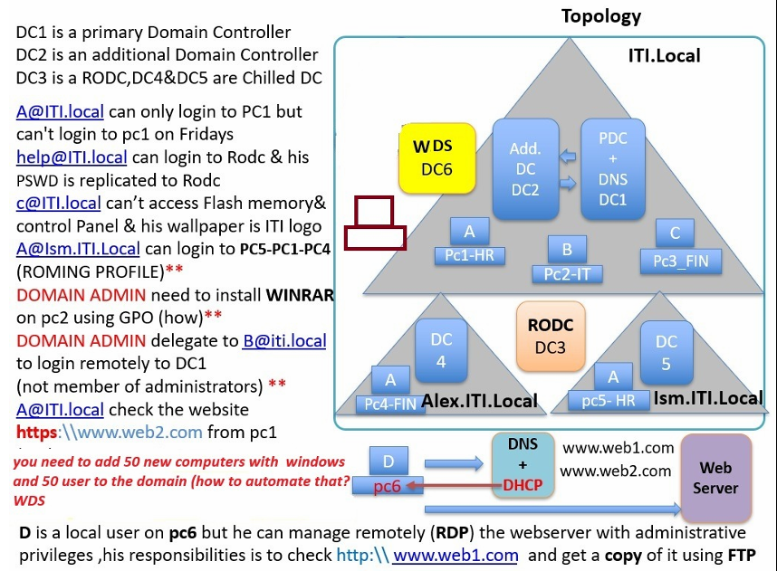

# Windows Server Infrastructure Project (MCSA)

---

## Project Overview

This project demonstrates the design and implementation of a complete **enterprise Windows Server infrastructure** simulating a real-world environment.

It covers core Microsoft technologies including:

- Active Directory Domain Services (AD DS)  
- DNS & DHCP  
- Group Policy (GPO)  
- Domain Controllers & RODC  
- IIS Web Server & FTP  
- Windows Deployment Services (WDS)  

---

## Full Documentation

For detailed explanation and step-by-step implementation:

👉 [View Full Project Documentation (PDF)](./MCSA%20Project%20Documentation.pdf)

---

## Architecture Diagram

  

---

## Domain Architecture

- Root Domain: `ITI.local`  
- Child Domains:
  - `ALEX.iti.local`
  - `ISMAILIA.iti.local`

### Domain Controllers

- DC1: Primary Domain Controller (PDC + DNS + IIS)  
- DC2: Additional Domain Controller  
- DC3: RODC (Read-Only Domain Controller)  
- DC4 & DC5: Child Domain Controllers  

---

## Infrastructure Services

### Web Server (IIS)
- Hosted websites:
  - http://www.web1.com  
  - http://www.web2.com  

### DNS
- Forward Lookup Zones configured  
- Conditional Forwarding for external domain resolution  

### DHCP
- Dynamic IP assignment across network  
- Active lease validation  

### FTP
- Configured for retrieving website content  

---

## Active Directory Features

- Multi-domain hierarchy (Parent + Child domains)  
- Organizational Units (OUs) for departments  
- Centralized authentication and management  

---

## Security & Policies (GPO)

Implemented multiple Group Policies:

- Restrict user login on specific days  
- Block Control Panel access  
- Disable USB storage access  
- Enforce corporate wallpaper  
- Automated software deployment (WinRAR)  

---

## Advanced Configurations

### RODC (Read-Only Domain Controller)
- Secure authentication in remote locations  
- Controlled password replication  

### Delegation
- Non-admin user granted RDP access to DC  
- Controlled administrative permissions  

---

## User & Environment Management

### Roaming Profiles
- User data synchronized across multiple machines  
- Cross-domain access (PC1 → PC4 / PC5)

### Bulk User Creation
- PowerShell script to create 50 users from CSV  

---

## Windows Deployment Services (WDS)

- Remote OS deployment over network  
- DHCP + PXE boot integration  
- Multiple Windows images available  

---

## What This Project Demonstrates

- Enterprise Active Directory design  
- Network services integration (DNS, DHCP, IIS)  
- Security enforcement using GPO  
- Infrastructure automation (PowerShell)  
- Scalable and manageable Windows environments  

---

## Tech Stack

- Windows Server  
- Active Directory  
- DNS / DHCP  
- IIS / FTP  
- PowerShell  
- WDS  

---

<h3>Emad Singab</h3>

Infrastructure • System Administration • Cloud • Virtualization

<a href="https://www.linkedin.com/in/emad-singab-189775320/">LinkedIn</a> • 
<a href="https://github.com/emadsingab">GitHub</a>

